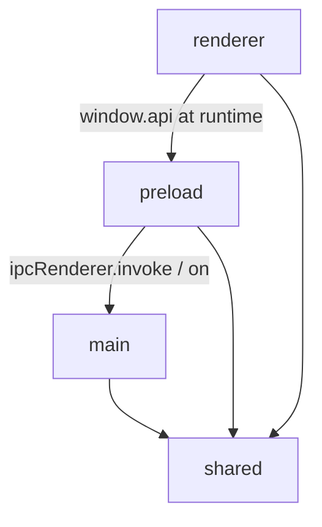

# Architecture

## Project Overview

Evermore is an Electron + React desktop app that provides a workspace-aware terminal UI. The
application is composed of three execution contexts that share a strict process boundary:

- **Main process** owns all native, OS-facing capabilities: PTY processes (`node-pty`), child
  processes for SSH tunnels, filesystem reads of `~/.ssh/config`, and persisted workspace state
  (`electron-store`).
- **Preload script** runs in an isolated context and exposes a typed `window.api` to the renderer
  through Electron's `contextBridge`. It is the only module that may use `ipcRenderer` directly.
- **Renderer process** is a React 19 app rendered by Vite. It keeps no native dependencies and
  reaches main-process services exclusively through `window.api`.

A `shared/` directory holds types and constants that need to be referenced from more than one
process boundary (IPC channel names, serializable models, the typed `Api` contract).

## Platform Assumptions

Evermore currently targets macOS as its primary supported platform. Platform-specific behavior may
use macOS conventions directly when doing so keeps the implementation simpler and the user
experience clearer.

Current macOS assumptions include:

- Keyboard shortcuts use macOS modifier names (`Command`, `Option`, `Control`, `Shift`) instead of
  cross-platform aliases such as `CommandOrControl`.
- The settings shortcut follows the macOS convention of `Cmd+,`.
- File-manager affordances may use Finder-oriented wording in the renderer UI.
- Main-process integrations may rely on Electron/macOS behavior where documented by the relevant
  feature.

If Evermore later adds first-class Windows or Linux support, these assumptions should be revisited
behind explicit platform adapters rather than scattered conditionals.

## Repository Layout

```text
src/
├── main/         # Electron main process: app lifecycle + native services
├── preload/      # Context bridge that exposes `window.api`
├── renderer/src/ # React renderer
└── shared/       # Cross-process types, constants, and pure helpers
```

Each layer's responsibilities, invariants, and allowed dependencies are described in the Main /
Preload / Renderer / Shared sections below. Sub-directory and file naming inside each layer is
conventional (one sub-directory per feature under `main/`, one section per UI area under
`renderer/src/components/`, etc.) but is not part of the architectural contract — `ls src/<layer>`
is the source of truth.

Top-level dependency rules:

- `shared/` is pure. It must not import from `main/`, `preload/`, `renderer/`, or any Electron,
  Node.js, browser, or React API. Only TypeScript standard library and in-tree `shared/` files are
  allowed.
- `main/` may use Node.js APIs and Electron's main-process modules. It must not import from
  `renderer/` or `preload/`.
- `preload/` may use `electron` (`contextBridge`, `ipcRenderer`). It must not import from `main/` or
  `renderer/`. It may import from `shared/` for types and IPC channel constants only.
- `renderer/` may use React, browser APIs, `xterm.js`, and `zustand`. It must not import from
  `main/`, `preload/` (except the type ambient declaration), or any Node-only module (`node-pty`,
  `electron-store`, `node:*`). All main-process capabilities must go through `window.api`.

## Dependency Overview



The renderer never has a static `import` from `preload/` — the only renderer-side reference is the
ambient `Window['api']` declaration in `src/preload/index.d.ts`, which is included only by the
renderer-only `tsconfig.web.json`.

## TypeScript Project Boundaries

The codebase has two `tsc` projects to keep the renderer/main runtime separation visible to the type
checker:

- `tsconfig.node.json` includes `src/main/**`, `src/preload/**`, `src/shared/**` and uses
  `@electron-toolkit/tsconfig/tsconfig.node.json`.
- `tsconfig.web.json` includes `src/renderer/src/**`, `src/shared/**`, and `src/preload/*.d.ts`. It
  uses `@electron-toolkit/tsconfig/tsconfig.web.json` and defines the `@renderer/*` path alias.

Both projects must pass under `pnpm run typecheck`. A renderer-side import from `main/` (or vice
versa) will fail typecheck because each project's `include` list does not pick up the other
process's source.

## Shared Layer

`shared/` is the contract between processes. Its responsibility is:

- Define the IPC channel name constants used by both `preload/` and `main/ipc/handlers/*`.
- Declare the `Api` interface that the preload exposes and the renderer consumes.
- Define cross-process serializable models (workspace tree, SSH hosts, tunnels, persisted settings,
  etc.) that round-trip through `structuredClone` / JSON without loss.
- Hold pure helpers that are safe in any runtime.

Invariants:

- Every type in `shared/types.ts` is **JSON-serializable**. Anything that crosses the IPC boundary
  must round-trip through `structuredClone`/JSON without loss. Runtime-only fields like `ptyId` and
  `initialCommand` on `Pane` are explicitly stripped before persistence by `sanitizePane()` in
  `WorkspaceStore`.
- Constants exported here (e.g. `TUNNEL_LOG_BUFFER_SIZE`) are the single source of truth used by
  both main and renderer to keep their ring buffer sizes aligned.

Allowed dependencies:

- TypeScript standard language features
- Other files within `shared/`

Disallowed dependencies:

- `main/`, `preload/`, `renderer/`
- Node.js APIs, Electron, browser/runtime APIs, React, zustand, xterm

## Main Layer

The main process is split by feature, with one runtime adapter class per feature plus a thin IPC
handler that bridges it to the renderer.

### Responsibilities

- The composition root creates the `BrowserWindow`, registers IPC handlers, wires the `before-quit`
  lifecycle, and disposes runtime resources at shutdown. Long-lived runtime state lives below it.
- A small per-window helper intercepts Cmd-modified renderer shortcuts (reload / zoom / production
  DevTools) without swallowing Ctrl-modified keys, which xterm needs intact for shell
  reverse-i-search.
- The IPC composition root instantiates each runtime manager once and threads it into the IPC
  handlers that depend on it, so handlers that need the same cached state share one instance. It
  returns a single runtime handle with a `dispose()` method so the app can dispose every handler and
  runtime resource on app quit.
- Per-feature IPC handlers are bridges that translate `ipcMain.handle` payloads into method calls on
  the corresponding manager and forward manager-emitted events back to the renderer via
  `webContents.send`. They are deliberately thin and contain no business logic.
- Per-feature manager classes own one runtime concern each (PTY processes, SSH tunnels, SSH config
  parsing, workspace persistence, settings persistence, pane activity polling, global hotkey, quit
  confirmation, etc.). Each manager exposes a serializable, dependency-injected API so unit tests
  can inject fakes (`spawn`, `now`, `getHomeDirectory`, storage adapter, etc.) without requiring a
  real Electron window, real PTY, or real filesystem. Layer-wide invariants the managers must uphold
  are listed below.

### Invariants

- **PTYs and tunnel child processes are owned by the main process and never serialized to disk.**
  The renderer references them only by string id (`ptyId`, alias). Dispose paths are wired into IPC
  teardown so app quit kills every spawned process.
- **PTY callbacks can outlive a `BrowserWindow`.** Every IPC handler that forwards an event to the
  renderer first checks `!window.isDestroyed()` and silently drops late events. Crashing the app on
  a stale callback is unacceptable.
- **Manager constructors take callbacks and a clock/spawn factory** so unit tests can inject fakes
  (`spawn`, `now`, `getHomeDirectory`, storage adapter, etc.) and must not require a real Electron
  window, real PTY, or real filesystem.
- **`SshConfigManager` is shared across SSH and tunnel handlers.** A second instance would mean two
  separate parses and a stale cache; `register.ts` is the only place that should construct it for
  production.
- **`SshHostResolver` is constructed once in `register.ts` and DI'd into the SSH handler.** A second
  instance would defeat the in-memory cache and force redundant `ssh -G` subprocess spawns on every
  renderer call.
- **Per-feature managers and handlers accept an optional `logger: Logger` constructor option.** The
  composition root in `src/main/index.ts` builds a `ConsoleTransport`-backed root logger and threads
  scoped children (`logger.child('pty')`, `logger.child('notifications')`, etc.) through
  `registerIpcHandlers`. Tests omit the option and inherit a silent no-op logger via
  `createSilentLogger()`, so they do not need to spy on `console`. The effective level resolves from
  `LOG_LEVEL`, falling back to `debug` in dev and `info` in prod.

### Allowed dependencies

- `shared/`
- Node.js built-ins, `electron` main-process modules, `node-pty`, `ssh-config`, `electron-store`

### Disallowed dependencies

- `renderer/`, `preload/`
- Browser runtime APIs, React, xterm

## Preload Layer

`preload/index.ts` is the only place where `ipcRenderer` is imported. It defines `window.api` and
uses `contextBridge.exposeInMainWorld` so the renderer can call main-process services through a
typed surface.

### Responsibilities

- Translate the renderer's namespaced API calls into `ipcRenderer.invoke` calls keyed by the
  constants in `shared/ipc-channels.ts`.
- For main-emitted events that fan out to many subscribers, register exactly one `ipcRenderer.on`
  listener per channel and dispatch to a subscriber set. This avoids exceeding Node's default
  10-listener cap when many panes or features subscribe to the same channel.
- Declare the global `Window['api']` ambient type so the renderer TypeScript project can consume it.

### Invariants

- The preload script is the **only** module that imports `electron` in the renderer process. The
  renderer must access main-process capabilities through `window.api` exclusively.
- `window.api` is `satisfies Api`, so any drift between the preload implementation and the `Api`
  interface in `shared/api-types.ts` fails typecheck.

### Allowed dependencies

- `shared/`
- `electron` (`contextBridge`, `ipcRenderer`)

### Disallowed dependencies

- `main/`, `renderer/`
- Node-only modules, React, xterm

## Renderer Layer

The renderer is a single React 19 app rendered into `#root` by `main.tsx` with `StrictMode` enabled.

### Responsibilities and Import Restrictions

- `App.tsx` mounts the layout and wires global event bridges that subscribe to main-process
  notifications and write them into the renderer stores. It is intentionally tiny: routing, business
  logic, and data fetching live elsewhere.
- `components/<area>/` directories own one top-level UI area each (layout shell, main terminal area,
  sidebar, settings panel, terminal pairing, etc.). Components inside an area may read from any
  zustand store but must not reach into another area's internal components or own feature-specific
  business logic that belongs in a store or hook.
- `hooks/` contains cross-feature hooks reusable across UI areas (event bridges from main →
  renderer, resize observation, etc.).
- `stores/` is the renderer's source of truth for UI and runtime mirrors of main-process state. Each
  store is built with a `createXxxStore()` factory that accepts options (API client, debounce
  intervals, clock) so tests can inject doubles. The exported `useXxxStore` singleton is the
  production wiring; tests must call the factory directly to obtain an isolated store. Persisted
  state (workspaces, app settings, etc.) lives behind a main-process IPC and is mirrored into a
  store, while purely transient renderer state (sidebar open/close, active main-area view, etc.)
  lives in a store only and resets on every launch.

### Invariants

- **A `<TerminalView>` instance owns a 1:1 mapping with one PTY.** The xterm instance and the PTY id
  live in `useTerminal`'s refs. The hook intentionally does **not** restart a PTY when `cwd` props
  change after creation; `cwd` is a process-creation input only. Restarting a running shell on prop
  drift would destroy the user's session.
- **`PaneLayout` flattens the pane tree.** Every pane leaf is rendered as a sibling absolute element
  so React identity stays stable across splits and closes; if the renderer used a recursive tree,
  splits would unmount + remount the xterm + PTY pair. See the comment in
  `components/main-area/PaneLayout.tsx`.
- **All workspaces stay mounted with `display:none` for the non-active ones.** This keeps each
  workspace's PTYs alive across workspace switches. The cost is eager PTY creation for every loaded
  workspace; this is documented as temporary in `MainTerminalArea.tsx`.
- **The renderer must not block on IPC errors.** Connection / tunnel stores preserve the last
  successful snapshot on failure so the sidebar keeps showing usable controls.
- **Workspace persistence is debounced** in the renderer (`workspaceStore`) and flushed via
  `getWorkspaceApi().update(workspace)`. Layout / cwd updates set the workspace dirty and share one
  timer; any structural mutation is a flush point.

### Allowed dependencies

- `shared/`
- React, zustand, xterm.js, lucide-react, tailwind-merge, clsx
- Browser runtime APIs

### Disallowed dependencies

- `main/`, `preload/` (other than the ambient `Window['api']` type from `src/preload/index.d.ts`)
- Node-only modules (`node:*`, `node-pty`, `child_process`, `electron-store`, `electron`, `fs`, …)

## IPC Boundary Contract

The IPC surface is the most important boundary in the app and follows a strict shape:

- All channel names live in `shared/ipc-channels.ts`. Both ends import from this module — string
  literals must not be duplicated.
- Renderer → main calls always go through `ipcRenderer.invoke` and return a `Promise`. They map to
  `ipcMain.handle` registrations in `src/main/ipc/handlers/*`.
- Main → renderer events go through `webContents.send` from a handler, after a guard against
  `window.isDestroyed()`. The renderer subscribes through one of the `on*` methods on `window.api`,
  which always return an unsubscribe function.
- Payloads are objects, not positional arguments, so handlers can accept additions without breaking
  older callers (e.g. `{ id, data }` instead of `(id, data)`).
- The `Api` type in `shared/api-types.ts` and the `satisfies Api` annotation in
  `src/preload/index.ts` keep the renderer-visible surface in sync with the preload implementation.
  Adding a new IPC method requires touching all three layers (channel name → handler → preload → Api
  type) so omissions surface in typecheck.
- Renderer-facing `PTY_CREATE` requests contain only `cwd` and optional `paneId`. The main-process
  handler explicitly constructs internal `PtyCreateOptions` from those fields and must not forward
  the renderer payload directly, so internal-only `shell`, `env`, `cols`, and `rows` options remain
  unreachable across the public IPC boundary.
- **Payload Validation**: All renderer-to-main payloads are accepted as `unknown` and structurally
  validated in the handlers before accessing runtime services or persistence layers.
- **Unknown Keys**: Unknown keys in incoming payloads are ignored and never forwarded. Handlers and
  schema readers reconstruct objects from validated known fields instead of casting and forwarding
  the raw input object.
- **Malformed Rejection vs. Allowlisting**: Malformed payloads (e.g. invalid types or lengths
  exceeding limits) throw an error containing only the channel name to avoid echoing arbitrary
  strings. Allowlisting check failures (e.g. requesting unauthorized SSH or tunnel aliases) throw a
  fixed authorization error.

## Testing

Tests are organized in three tiers by subject scope. The runner is Vitest (config in
`vitest.config.ts`). The default environment is `jsdom` for `src/main/**`, `src/renderer/src/**`,
`src/shared/**`, and `tests/**` tests; individual test files can opt into the Node environment when
they need real Node-only APIs (for example the e2e suite that drives `node-pty`). Shared setup that
registers DOM matchers and React Testing Library cleanup lives in `tests/setup.ts`.

### Tier policy

- **Unit tests** verify a single module (class / function / hook / component) in isolation. The
  surrounding dependencies are replaced by mocks, fakes, or pure data inputs. Unit tests are
  colocated with the code they cover (`src/**/*.test.{ts,tsx}`). The vast majority of tests fall
  here.
- **Integration tests** combine multiple real modules — typically across feature directories —
  without mocking the seams between them. They must remain deterministic and host-independent (no
  external process, no network, no host-dependent filesystem reads beyond temp dirs or checked-in
  fixtures). They live in `tests/integration/` so cross-module wiring is visible and is not mistaken
  for a unit test of either side.
- **End-to-end tests** depend on a runtime external dependency (real subprocess such as zsh / ssh,
  real network socket, etc.). They live in `tests/e2e/` and use `describe.skipIf(...)` to skip when
  that dependency is unavailable on the current host (for example, `existsSync('/bin/zsh')` is
  false). CI does not install these dependencies, so the affected suites skip there; developers must
  run `pnpm test` on a host that satisfies the dependency when changing covered code.

### Invariants

- Main-process tests follow Node-oriented constraints despite running in `jsdom`: they exercise pure
  managers and injected adapters, not browser APIs.
- Main-process unit tests inject fakes through manager constructor options (`spawn`, `now`,
  `storage`, `getHomeDirectory`, `parse`, `readFile`, `readDirectory`). They must not require a real
  Electron window, real PTY, real ssh process, or real filesystem.
- Renderer store tests use the `create<Store>()` factory with injected options instead of the global
  singleton, so test cases stay isolated.
