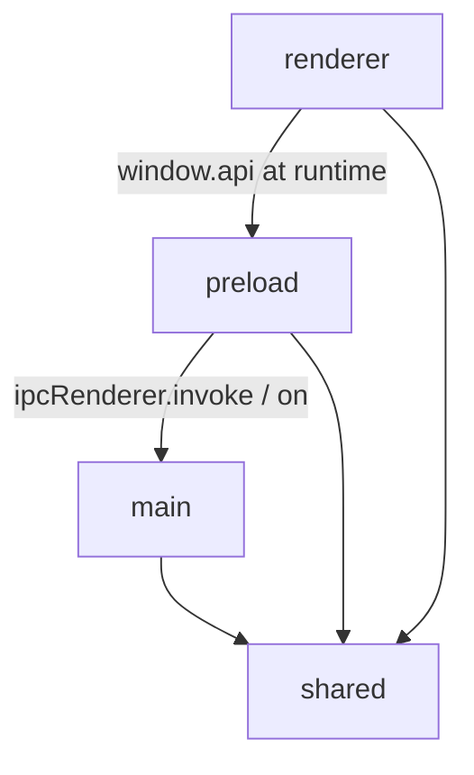

# Architecture

## Project Overview

Evermore is an Electron + React desktop app that provides a workspace-aware terminal UI. The
application is composed of three execution contexts that share a strict process boundary:

- **Main process** owns all native, OS-facing capabilities: PTY processes (`node-pty`), child
  processes for SSH tunnels, filesystem reads of `~/.ssh/config`, and persisted workspace state
  (`electron-store`).
- **Preload script** runs in an isolated context and exposes a typed `window.api` to the renderer
  through Electron's `contextBridge`. It is the only module that may use `ipcRenderer` directly.
- **Renderer process** is a React 19 app rendered by Vite. It keeps no native dependencies and
  reaches main-process services exclusively through `window.api`.

A `shared/` directory holds types and constants that need to be referenced from more than one
process boundary (IPC channel names, serializable models, the typed `Api` contract).

## Repository Layout

```text
src/
├── main/         # Electron main process: app lifecycle + native services
│   ├── index.ts          # App entry: window, IPC registration, shutdown
│   ├── window-shortcuts.ts
│   ├── ipc/              # IPC composition root and handlers
│   ├── pty/              # PtyManager (node-pty)
│   ├── tunnels/          # TunnelManager (child_process for `ssh -N`)
│   ├── ssh-config/       # SshConfigManager + parser + SshHostResolver (ssh -G)
│   └── workspace/        # WorkspaceStore (electron-store)
├── preload/      # Context bridge that exposes `window.api`
├── renderer/src/ # React renderer
│   ├── main.tsx          # ReactDOM root
│   ├── App.tsx           # Mounts AppShell + global event bridges
│   ├── components/       # Layout, sidebar, main area, terminal
│   ├── hooks/            # Cross-feature hooks
│   ├── stores/           # zustand stores (workspace, ui, connections, tunnels, sshResolutions)
│   ├── styles/
│   └── test/
└── shared/       # Cross-process types, constants, and pure helpers
    ├── types.ts          # Workspace / Tab / Pane / SSHHost / Tunnel / AppSettings
    ├── api-types.ts      # `Api` shape exposed on window.api
    ├── ipc-channels.ts   # IPC channel name constants
    ├── pane-layout.ts    # Pure helpers: countPaneLeaves, flattenLayout
    └── tunnel-constants.ts
```

Top-level dependency rules:

- `shared/` is pure. It must not import from `main/`, `preload/`, `renderer/`, or any Electron,
  Node.js, browser, or React API. Only TypeScript standard library and in-tree `shared/` files are
  allowed.
- `main/` may use Node.js APIs and Electron's main-process modules. It must not import from
  `renderer/` or `preload/`.
- `preload/` may use `electron` (`contextBridge`, `ipcRenderer`). It must not import from `main/` or
  `renderer/`. It may import from `shared/` for types and IPC channel constants only.
- `renderer/` may use React, browser APIs, `xterm.js`, and `zustand`. It must not import from
  `main/`, `preload/` (except the type ambient declaration), or any Node-only module (`node-pty`,
  `electron-store`, `node:*`). All main-process capabilities must go through `window.api`.

## Dependency Overview



The renderer never has a static `import` from `preload/` — the only renderer-side reference is the
ambient `Window['api']` declaration in `src/preload/index.d.ts`, which is included only by the
renderer-only `tsconfig.web.json`.

## TypeScript Project Boundaries

The codebase has two `tsc` projects to keep the renderer/main runtime separation visible to the type
checker:

- `tsconfig.node.json` includes `src/main/**`, `src/preload/**`, `src/shared/**` and uses
  `@electron-toolkit/tsconfig/tsconfig.node.json`.
- `tsconfig.web.json` includes `src/renderer/src/**`, `src/shared/**`, and `src/preload/*.d.ts`. It
  uses `@electron-toolkit/tsconfig/tsconfig.web.json` and defines the `@renderer/*` path alias.

Both projects must pass under `pnpm run typecheck`. A renderer-side import from `main/` (or vice
versa) will fail typecheck because each project's `include` list does not pick up the other
process's source.

## Shared Layer

`shared/` is the contract between processes. Its responsibility is:

- Define the IPC channel names (`ipc-channels.ts`) used by both `preload/` and
  `main/ipc/handlers/*`.
- Declare the `Api` interface (`api-types.ts`) that the preload exposes and the renderer consumes.
- Define cross-process serializable models (`types.ts`): `Workspace`, `Tab`, `Pane`, `PaneLayout`,
  `SSHHost`, `Tunnel`, `ForwardEntry`, `AppSettings`.
- Hold pure helpers that are safe in any runtime (`pane-layout.ts`).

Invariants:

- Every type in `shared/types.ts` is **JSON-serializable**. Anything that crosses the IPC boundary
  must round-trip through `structuredClone`/JSON without loss. Runtime-only fields like `ptyId` and
  `initialCommand` on `Pane` are explicitly stripped before persistence by `sanitizePane()` in
  `WorkspaceStore`.
- Constants exported here (e.g. `TUNNEL_LOG_BUFFER_SIZE`) are the single source of truth used by
  both main and renderer to keep their ring buffer sizes aligned.

Allowed dependencies:

- TypeScript standard language features
- Other files within `shared/`

Disallowed dependencies:

- `main/`, `preload/`, `renderer/`
- Node.js APIs, Electron, browser/runtime APIs, React, zustand, xterm

## Main Layer

The main process is split by feature, with one runtime adapter class per feature plus a thin IPC
handler that bridges it to the renderer.

### Responsibilities

- `index.ts` is the runtime composition root. It creates the `BrowserWindow`, attaches per-window
  shortcut suppression, calls `registerIpcHandlers`, and disposes IPC handlers on `before-quit`.
  Long-lived runtime state lives below it.
- `window-shortcuts.ts` is a small, pure-ish helper that intercepts Cmd-modified renderer shortcuts
  (reload / zoom / production DevTools) without swallowing Ctrl-modified keys, which xterm needs
  intact for shell reverse-i-search.
- `ipc/register.ts` is the IPC composition root. It instantiates the shared `SshConfigManager` and
  threads it into the SSH and tunnel handlers, so both expose the same cached host list. It returns
  a single teardown function so the app can dispose every handler and runtime resource at shutdown.
- `ipc/handlers/<feature>.ts` files are bridges: they translate `ipcMain.handle` payloads into
  method calls on the corresponding manager and forward manager-emitted events back to the renderer
  via `webContents.send`. They are deliberately thin and contain no business logic.
- `pty/`, `tunnels/`, `ssh-config/`, `workspace/` each own one runtime concern and expose a
  serializable, dependency-injected API:
  - `PtyManager` owns `node-pty` processes and emits `onData` / `onExit` events.
  - `TunnelManager` owns `ssh -N <alias>` child processes, status transitions, log ring buffers, and
    graceful SIGTERM → SIGKILL termination.
  - `SshConfigManager` reads and caches `~/.ssh/config`, expanding `Include` directives (including
    globs) with OpenSSH-compatible semantics. `SshHostResolver` provides on-demand `ssh -G`
    resolution for detailed host directives, caching results in memory until `ssh:reload-hosts`
    invalidates them.
  - `WorkspaceStore` persists workspaces and the active workspace id in `electron-store`, sanitizing
    runtime-only pane fields before write.

### Invariants

- **PTYs and tunnel child processes are owned by the main process and never serialized to disk.**
  The renderer references them only by string id (`ptyId`, alias). Dispose paths are wired into IPC
  teardown so app quit kills every spawned process.
- **PTY callbacks can outlive a `BrowserWindow`.** Every IPC handler that forwards an event to the
  renderer first checks `!window.isDestroyed()` and silently drops late events. Crashing the app on
  a stale callback is unacceptable.
- **Manager constructors take callbacks and a clock/spawn factory** so unit tests can inject fakes
  (`spawn`, `now`, `getHomeDirectory`, storage adapter, etc.) and must not require a real Electron
  window, real PTY, or real filesystem.
- **`SshConfigManager` is shared across SSH and tunnel handlers.** A second instance would mean two
  separate parses and a stale cache; `register.ts` is the only place that should construct it for
  production.
- **`SshHostResolver` is constructed once in `register.ts` and DI'd into the SSH handler.** A second
  instance would defeat the in-memory cache and force redundant `ssh -G` subprocess spawns on every
  renderer call.

### Allowed dependencies

- `shared/`
- Node.js built-ins, `electron` main-process modules, `node-pty`, `ssh-config`, `electron-store`

### Disallowed dependencies

- `renderer/`, `preload/`
- Browser runtime APIs, React, xterm

## Preload Layer

`preload/index.ts` is the only place where `ipcRenderer` is imported. It defines `window.api` and
uses `contextBridge.exposeInMainWorld` so the renderer can call main-process services through a
typed surface.

### Responsibilities

- Translate the renderer's namespaced API calls (`api.pty.create`, `api.workspace.list`, …) into
  `ipcRenderer.invoke` calls keyed by the constants in `shared/ipc-channels.ts`.
- Multiplex `pty:data` / `pty:exit` / `tunnel:status-changed` / `tunnel:log` events by registering
  exactly one `ipcRenderer.on` listener per channel and dispatching to a subscriber set. This avoids
  exceeding Node's default 10-listener cap when many panes are open.
- Declare the global `Window['api']` ambient type in `index.d.ts` so the renderer TypeScript project
  can consume it.

### Invariants

- The preload script is the **only** module that imports `electron` in the renderer process. The
  renderer must access main-process capabilities through `window.api` exclusively.
- `window.api` is `satisfies Api`, so any drift between the preload implementation and the `Api`
  interface in `shared/api-types.ts` fails typecheck.

### Allowed dependencies

- `shared/`
- `electron` (`contextBridge`, `ipcRenderer`)

### Disallowed dependencies

- `main/`, `renderer/`
- Node-only modules, React, xterm

## Renderer Layer

The renderer is a single React 19 app rendered into `#root` by `main.tsx` with `StrictMode` enabled.

### Responsibilities and Import Restrictions

- `App.tsx` mounts the layout and wires global event bridges (currently `useTunnelEventBridge`). It
  is intentionally tiny: routing, business logic, and data fetching live elsewhere.
- `components/layout/` (`AppShell`, `Sidebar`, `TopBar`) owns the top-level frame. Components here
  may read from any zustand store but must not own feature-specific business logic.
- `components/main-area/` owns the tab/pane/terminal frame: `TabBar`, `PaneLayout`,
  `MainTerminalArea`. `PaneLayout` flattens the pane tree (see invariants below) and
  `MainTerminalArea` keeps each workspace mounted while toggling visibility.
- `components/sidebar/` owns the Workspaces and Connections views and their sections
  (`SSHHostsSection`, `TunnelsSection`).
- `components/terminal/` owns the xterm.js + PTY pairing for one pane:
  - `TerminalView.tsx` renders the container and the inactive overlay.
  - `useTerminal.ts` constructs the xterm instance, connects it to `window.api.pty`, and registers
    an OSC 7 handler that emits `onCwdChange`.
  - `osc7.ts` and `theme.ts` are pure helpers consumed by the hook.
- `hooks/` contains cross-feature hooks reusable across pages: `useTunnelEventBridge`,
  `useReloadConnections`, `useResizeObserver`.
- `stores/` is the renderer's source of truth for UI and runtime mirrors of main-process state. Each
  store is built with a `create<Store>()` factory that accepts options (API client, debounce
  intervals, clock) so tests can inject doubles. The exported singleton (`useWorkspaceStore`, …) is
  the production wiring; tests should call `createWorkspaceStore({ ... })` directly and avoid the
  singleton.
  - `workspaceStore.ts` mirrors the persisted workspace tree, debounces writes to main, and exposes
    selectors `selectActiveWorkspace` / `selectActiveTab` / `selectActivePane`. Pure tree
    manipulation lives in the same file as private helpers.
  - `uiStore.ts` is purely transient renderer state (sidebar view, sidebar open/close, sidebar
    width). The open/close flag and width are intentionally not persisted: every app launch starts
    with the sidebar open at the default width.
  - `connectionsStore.ts` mirrors SSH host data fetched via `window.api.ssh`.
  - `tunnelsStore.ts` mirrors tunnel runtime state and is updated by `useTunnelEventBridge` from
    main-process events.
  - `sshResolutionsStore.ts` caches on-demand SSH host resolution results fetched via
    `window.api.ssh.resolve`. It is cleared whenever SSH hosts are reloaded.

### Invariants

- **A `<TerminalView>` instance owns a 1:1 mapping with one PTY.** The xterm instance and the PTY id
  live in `useTerminal`'s refs. The hook intentionally does **not** restart a PTY when `cwd` props
  change after creation; `cwd` is a process-creation input only. Restarting a running shell on prop
  drift would destroy the user's session.
- **`PaneLayout` flattens the pane tree.** Every pane leaf is rendered as a sibling absolute element
  so React identity stays stable across splits and closes; if the renderer used a recursive tree,
  splits would unmount + remount the xterm + PTY pair. See the comment in
  `components/main-area/PaneLayout.tsx`.
- **All workspaces stay mounted with `display:none` for the non-active ones.** This keeps each
  workspace's PTYs alive across workspace switches. The cost is eager PTY creation for every loaded
  workspace; this is documented as temporary in `MainTerminalArea.tsx`.
- **The renderer must not block on IPC errors.** Connection / tunnel stores preserve the last
  successful snapshot on failure so the sidebar keeps showing usable controls.
- **Workspace persistence is debounced** in the renderer (`workspaceStore`) and flushed via
  `getWorkspaceApi().update(workspace)`. Layout / cwd updates set the workspace dirty and share one
  timer; any structural mutation is a flush point.

### Allowed dependencies

- `shared/`
- React, zustand, xterm.js, lucide-react, tailwind-merge, clsx
- Browser runtime APIs

### Disallowed dependencies

- `main/`, `preload/` (other than the ambient `Window['api']` type from `src/preload/index.d.ts`)
- Node-only modules (`node:*`, `node-pty`, `child_process`, `electron-store`, `electron`, `fs`, …)

## IPC Boundary Contract

The IPC surface is the most important boundary in the app and follows a strict shape:

- All channel names live in `shared/ipc-channels.ts`. Both ends import from this module — string
  literals must not be duplicated.
- Renderer → main calls always go through `ipcRenderer.invoke` and return a `Promise`. They map to
  `ipcMain.handle` registrations in `src/main/ipc/handlers/*`.
- Main → renderer events go through `webContents.send` from a handler, after a guard against
  `window.isDestroyed()`. The renderer subscribes through one of the `on*` methods on `window.api`,
  which always return an unsubscribe function.
- Payloads are objects, not positional arguments, so handlers can accept additions without breaking
  older callers (e.g. `{ id, data }` instead of `(id, data)`).
- The `Api` type in `shared/api-types.ts` and the `satisfies Api` annotation in
  `src/preload/index.ts` keep the renderer-visible surface in sync with the preload implementation.
  Adding a new IPC method requires touching all three layers (channel name → handler → preload → Api
  type) so omissions surface in typecheck.

## Testing

- Test files are colocated with source files (`foo.ts` ↔ `foo.test.ts`).
- Vitest is configured by `vitest.config.ts`. The current test runner uses one global `jsdom`
  environment for `src/main/**`, `src/renderer/src/**`, and `src/shared/**` tests, with renderer
  setup loaded from `src/renderer/src/test/setup.ts`.
- Main-process tests still follow Node-oriented constraints even though the test environment is
  `jsdom`: they should exercise pure managers and injected adapters, not browser APIs.
- Main-process unit tests inject fakes through manager constructor options (`spawn`, `now`,
  `storage`, `getHomeDirectory`, `parse`, `readFile`, `readDirectory`). They must not require a real
  Electron window, real PTY, real ssh process, or real filesystem.
- Renderer store tests should use the `create<Store>()` factory with injected options instead of the
  global singleton, so test cases stay isolated.
