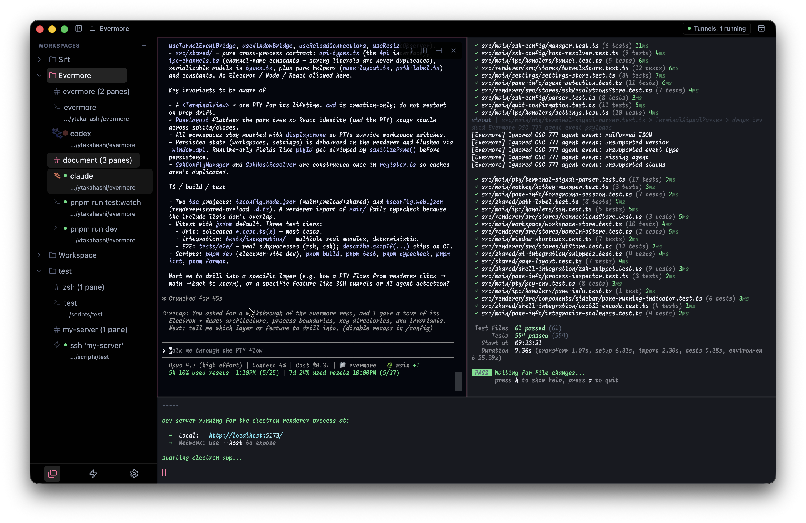

# Evermore

Evermore is a smart terminal workspace that gives you an at-a-glance overview of your terminals and
connections.

## Features

### Core Features

Evermore provides a highly informative workspace by default:

- **Persistent Workspace Layouts**: The sidebar workspace, tab structure, and split-pane terminal
  layouts are persisted across sessions.
- **Pane Status Indicators**: Sidebar lists reflect whether a terminal pane is currently `running`
  or `idle`, using system-level process monitoring.
- **Active Process & Command Labels**: Sidebar pane items display the name of the active foreground
  program (e.g., `node`, `ssh`) or the cwd when `idle`.
- **AI Agent Awareness**: Detects AI agent CLIs and replaces the generic terminal icon with an agent
  icon.
- **SSH Config & Tunnel Management**: Discovers host shortcuts from `~/.ssh/config` for one-click
  terminal connections, and manages SSH port-forwarding tunnels with real-time status.

### Shell-Integrated Features (Zsh)

Zsh shell integration gives the workspace UI shell-level accuracy and responsiveness:

- **Auto-Injection**: Enabled by default; starting a Zsh pane automatically sets up integration.
- **Real-Time Directory Sync**: The pane's cwd updates instantly as you change directories.
- **Exact Command & Alias Labels**: Pane labels in the sidebar display the exact command line you
  typed (such as `pnpm run dev`), rather than generic process names (such as `node`).

### AI Agent Hook Integration

With AI agent hooks configured, the sidebar reflects per-pane agent status in real time:

- **Live Activity Status**: Shows when an agent turn is in progress.
- **Awaiting Input Alerts**: Highlights panes blocked on a permission prompt.
- **Ready on Completion**: Shows the pane as ready when the agent finishes its turn.

## Recommended Setup

- **Zsh Auto-Injection (zsh)**: Enabled by default. You can toggle this behavior under **Settings >
  Advanced features**.
- **SSH Config**: Open **Settings > Recommended setup** to view and copy recommended SSH tunnel
  reliability configuration (such as keep-alives) that keep background port-forwarding tunnels
  reliable.
- **Manual Shell Setup (Fallback)**: Copy the Shell integration (zsh) snippet from **Settings >
  Recommended setup** if you run custom shells or subshells, or prefer to configure shell
  integration manually.
- **AI Agent Hooks**: Open **Settings > AI Integration** to copy the Evermore agent status helper
  and agent hook snippets.
